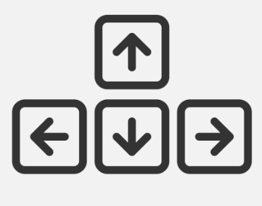

# Road Fighter
================

## Descripción del Proyecto
---------------------------

Road Fighter es un prototipo del juego de carreras desarrollado producido por Konami y lanzado en los arcades en 1984. Este prototipo utiliza la biblioteca SFML (Simple and Fast Multimedia Library) en C++. El juego consiste en un personaje que debe evitar obstáculos que se generan en la carretera mientras se mueve hacia adelante. El objetivo es sobrevivir durante un período de tiempo determinado.

## Características del Juego
-----------------------------

* El juego cuenta con un personaje que se puede controlar utilizando las teclas de flecha.  

* Los obstáculos se generan en la carretera de manera aleatoria y se mueven hacia adelante.  

* El jugador debe evitar chocar con los obstáculos para sobrevivir.
* El juego cuenta con un temporizador que muestra el tiempo restante para completar el nivel.
* Una vez completado el tiempo haz ganado el juego.  

* El juego se reinicia automáticamente cuando el jugador colisiona contra un auto obstáculo.

##Diagrama UML
---------------------------  

Link de descarga para el diagrama: 

https://drive.google.com/drive/folders/125-YcVTgevpDldoFwBm6ivioNZ6OIFLM?usp=sharing

## Estructura del Proyecto
---------------------------

El proyecto está estructurado de la siguiente manera:

* `escenario.cpp`: archivo principal que contiene la función `main` y la lógica del juego.
* `Personaje.hpp`: archivo que definen la clase `Personaje` que representa al personaje del jugador en el juego.
* `Obstaculo.hpp`: archivo que definen la clase `Obstaculo` que representa a los autos obstáculo del juego.
* `Control.hpp`: archivo que definen la clase `Control` que maneja el movimiento del personaje.
* `Vidas.hpp`: archivo que definen la clase `Vidas` que maneja las vidas del jugador.
* `Texto.hpp`: archivo que definen la clase `Texto` que maneja los textos del juego.
* `Musica.hpp`: archivo que definen la clase `Musica` que maneja la música del juego.
* `Contador.hpp`: archivo que definen la clase `Contador` que maneja el temporizador del juego para ganar.

## Requisitos del Proyecto
---------------------------

* SFML (Simple and Fast Multimedia Library) versión 2.5.1 o superior.
* Compilador C++ compatible con SFML.

## Manual
--------------------------
Las únicas teclas necesarias son el pad de flechas. Con ellas podrás mover a tu personaje por el escenario para esquivar los obstáculos.   

## Instalación y Ejecución
---------------------------

1. Clona el repositorio del proyecto utilizando Git.
2. Visita el repositorio en GitHub con el link https://github.com/navarroceti/EjemplosJuego para tener enlaces directos a la descarga de MSYS, git, indicaciones, etc.
3. Compila el proyecto utilizando un compilador C++ compatible con SFML.
4. Ejecuta el archivo ejecutable Escenario.cpp generado para comenzar a jugar.

## Licencia
------------

Puedes utilizar, modificar y distribuir el código fuente del proyecto según tus necesidades.